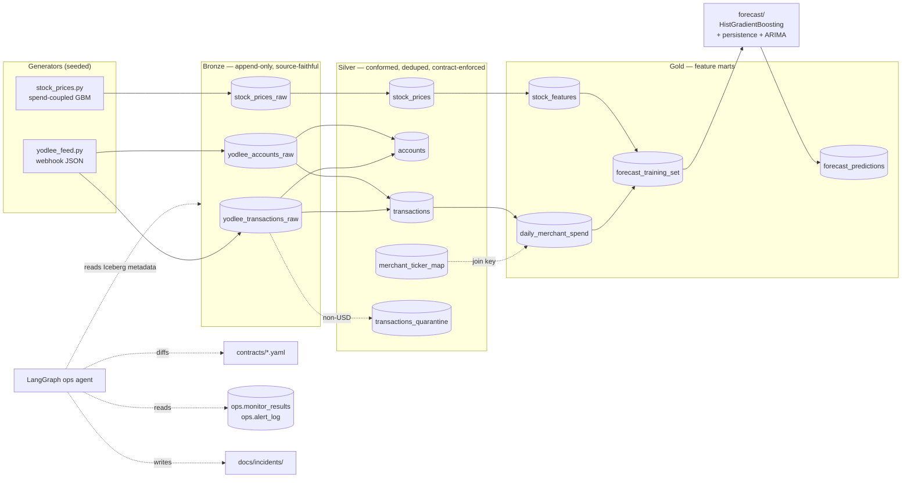

# Autonomous Data Platform

An Apache Iceberg lakehouse — Bronze / Silver / Gold — that ingests two feeds,
joins them on merchant identity, trains a forecast model with leakage controls,
and is operated by an agentic layer that detects schema drift, volume anomalies,
staleness, and arrival-SLA breaches against declared data contracts.

It runs offline from a clean clone. No cloud account, no JVM, no API key.

```bash
uv sync && uv run make all
```

> **Read this before the results.** The stock prices in this repository are
> **synthetic**, generated with a per-ticker spend→return relationship planted at
> a known lag ([ADR-0004](docs/architecture/ADR-0004-synthetic-spend-coupled-prices.md)).
> Every forecast number below measures **pipeline fidelity** — did the platform
> preserve a signal known to be present — and **not real-world alpha**. The
> measured outcome is that the model beats its persistence baseline on **0 of 6**
> tickers. That is reported as-is.

---

## What this is

A complete data platform, built end to end, small enough to read:

- **Iceberg lakehouse** — hidden partitioning, snapshot isolation, time travel,
  five schema versions, cross-version queries resolved by field ID, snapshot
  expiry, and metadata-only introspection. Each has a test; most have a `make`
  target you can run and read the output of.
- **Dual engine** — PyIceberg + DuckDB by default; Spark opt-in behind one
  protocol, with a cross-engine parity test that actually ran (on
  `silver.transactions` — see the scope note below).
- **Data contracts** — YAML, fail-closed, read by both the pipeline and the
  agent. Freshness evaluated against a logical as-of date, never wall-clock.
- **A forecast with real leakage controls** — purged walk-forward CV, and every
  feature independently recomputed by a second implementation on every training
  row.
- **An agentic ops layer** — LangGraph, rules-first, dry-run by default, offline.
- **17 data-quality monitors + 8 arrival checks** with persisted metric history
  and robust (median/MAD) baselines. 10 of the 17 are declared in YAML; the
  other 7 are column-type checks generated per contract field.
- **The AI-SDLC record** — the spec, the plan, every task brief, every review
  diff, and a ledger of what was found and changed. See
  [`docs/ai-sdlc/`](docs/ai-sdlc/workflow.md).

## The problem it solves

The hypothesis under test:

> Aggregated consumer card spend at a company's merchants is a leading indicator
> of that company's forward stock returns.

Six consumer-facing companies (SBUX, CMG, TGT, LULU, DPZ, ULTA), ~250,000
transactions across 2,000 synthetic accounts over 2024-01-01 → 2026-06-30
(626 NYSE trading days). About **60% of transaction volume is at untracked
merchants** — grocery, gas, rent, payroll, ATM — so the merchant→ticker join has
to actually discriminate.

Building this honestly is harder than it sounds, and the hard parts are the ones
that fail silently:

- **Look-ahead leakage.** A rolling window with the wrong frame, or a fold
  boundary that lets a 5-day-forward target bleed backwards, produces excellent
  metrics that mean nothing.
- **Sign conventions.** Source amounts are unsigned; direction lives in
  `baseType`. Get it wrong and spend looks like income.
- **Drift.** Upstream adds a column, renames one, or stops sending data. The
  pipeline keeps running.
- **Silence.** Every row-level quality check — nulls, ranges, duplicates —
  passes when nothing arrives at all.

Each of those has a specific mechanism in this repo, and each mechanism has a
test that can fail.

## Architecture



**Layer boundaries are rules, not naming**
([ADR-0003](docs/architecture/ADR-0003-medallion-layer-boundaries.md)):

- **Bronze** is append-only and source-faithful. Nested structs stay nested,
  dates stay source strings, nothing is cleaned. Every row carries
  `_ingested_at`, `_source_file`, `_payload_hash`, `_raw_payload`.
- **Silver** coerces types, deduplicates on `id` (greatest `lastUpdated` wins,
  ties by `_ingested_at`), applies `signed_amount`, normalizes merchants,
  **quarantines non-USD rows rather than converting or dropping them**, and
  validates contracts fail-closed.
- **Gold** builds features. Every feature at date *t* uses only data ≤ *t*.
- **No transform may skip a layer.**

**The no-leakage guarantee is measured, not asserted.** Every feature produced by
the Gold SQL is recomputed by a second, independent implementation
(`src/forecast/features.py::recompute_row`, which shares no code with the SQL)
across **all 3,756 training rows × 14 features = 52,584 comparisons**:

- maximum discrepancy **1.42e-14**
- **zero** null-presence mismatches

The exhaustive version of that test caught a real bug that the sampled version
was structurally blind to: on days with no transactions the recomputation fell
through to the last *available* spend row and labelled it as-of the wrong date.

Validation is **purged expanding-window walk-forward CV**, 5 folds, with a 5-day
purge between train and test (the target horizon). The gap is always purge + 1,
verified across a sweep of fold counts and series lengths.

## Quickstart

Requires Python ≥ 3.11 and [uv](https://docs.astral.sh/uv/).

```bash
uv sync                    # install
uv run make all            # bronze -> silver -> gold -> forecast
uv run make test           # the full suite
uv run make lint           # ruff
```

| Target | What it does |
|---|---|
| `make all` | `bronze silver gold forecast` end to end, offline, deterministic |
| `make monitor` | 17 data-quality checks; persists metrics to `ops.monitor_results` and routes alerts to `ops.alert_log` (**dry-run** unless `--execute`) |
| `make arrival` | 8 checks across 3 arrival SLAs, on the NYSE trading calendar |
| `make agent` | the LangGraph ops agent (**dry-run** unless `--execute`) |
| `make schema-history` | every schema version with field ids |
| `make cross-version` | one query spanning snapshots written under different schemas |
| `make timetravel` | read at snapshot N−1 vs N |
| `make drift-demo` | evolve the schema and inject a volume collapse |
| `make maintenance` | expire old snapshots |
| `make smoke` | `make all` at `N_TRANSACTIONS=5000` |

Useful environment variables:

```bash
N_TRANSACTIONS=5000 uv run make all     # reduced scale
AS_OF_DATE=2026-07-31 uv run make arrival   # reproduce a stale feed
ENGINE=spark uv run make silver         # opt-in Spark path (needs Java + Maven Central)
```

To see the whole story in order:

```bash
uv run make all && uv run make agent          # clean: 0 findings
uv run make drift-demo && uv run make agent   # after drift: 5 findings, 2 incidents
```

Both transcripts below are from that exact sequence, on a warehouse with no
`ops.monitor_results` history. Slot a `make monitor` in before `drift-demo` and
the post-drift run reports **6** findings and 3 incidents, not 5 and 2: the
persisted baseline of 250,000 added records lets `bronze_txn_row_count` breach
as well, which the agent folds in as a `monitor_breach` finding on top of the
volume anomaly its own sensor already found. That is the monitors working, not
a discrepancy — but the count depends on the history in the warehouse, so the
sequence that produced a number is stated with it.

### Dual engine

`src/lakehouse/engines/base.py` defines an 11-method `LakehouseEngine` protocol
with two implementations
([ADR-0002](docs/architecture/ADR-0002-pyiceberg-default-spark-optional.md)).
`tests/test_engine_parity.py` builds Silver through both and diffs the results
row-for-row.

**It ran.** 9 tests pass on PySpark 3.5.1 / Java 17 / Iceberg runtime 1.5.2, and
Silver built through both engines is identical. The test has demonstrated teeth:
neutralising the `TZ=UTC` fix on an EDT host produces a real ~8-hour
`_ingested_at` divergence, caught at value level.

**Scope, precisely: parity covers `silver.transactions` only — not Bronze, not
Gold.** The abstraction is proven where it was tested. The Spark path also needs
Maven Central for the Iceberg JAR, so unlike the PyIceberg path it is not
offline. Without PySpark installed the parity tests skip cleanly and
`spark_engine.py` is never imported.

**Three maintenance commands are PyIceberg-only, and now say so.**
`drift-demo`, `cross-version`, and `expire` reach past the protocol to
`engine.catalog` for APIs it does not expose (`update_schema`, per-snapshot
`table.schemas()`, `expire_snapshots`). They used to fail under `ENGINE=spark`
with a bare `AttributeError` from inside a helper; they now stop with a message
naming the command and telling you to use `ENGINE=pyiceberg`. Widening the
protocol by three Iceberg-specific methods and implementing them twice was the
alternative, and it buys a portable *demo* at the cost of a permanently larger
interface — the pipeline itself (`make all`, `monitor`, `arrival`, the agent)
stays fully dual-engine either way. `timetravel` and `schema-history` use
protocol methods only and work on both.

## Schema evolution and cross-version queries

`make drift-demo` walks Bronze through five schema versions, then
`make cross-version` reads across them in one query.

```console
$ uv run make drift-demo
drift-demo: applied v2: +merchantCategoryCode (string)
drift-demo: applied v3: +settlementDays (int)
drift-demo: applied v4: settlementDays int -> long
drift-demo: applied v5: checkNumber -> check_reference
drift-demo: appended a collapsed batch of 5 rows
```

| Version | Change | Kind |
|---|---|---|
| v1 → v2 | add `merchantCategoryCode` (string) | additive |
| v2 → v3 | add `settlementDays` (int) | additive |
| v3 → v4 | widen `settlementDays` int → long | type promotion |
| v4 → v5 | rename `checkNumber` → `check_reference` | metadata-only |

**All four are metadata-only. Not one data file is rewritten.**

### Why the rename does not lose data: field IDs

`make schema-history` prints every version with its field ids. The two versions
that matter, abridged:

```console
$ uv run make schema-history
schema 3: 30 columns
    ...
    [ 19] sourceType: string
    [ 20] checkNumber: string
    [ 21] isManual: boolean
    ...
    [ 40] merchantCategoryCode: string
    [ 41] settlementDays: long
schema 4: 30 columns
    ...
    [ 19] sourceType: string
    [ 20] check_reference: string
    [ 21] isManual: boolean
    ...
    [ 40] merchantCategoryCode: string
    [ 41] settlementDays: long
```

`checkNumber` and `check_reference` are **both field id 20**. Iceberg resolves
columns by field ID, not by name — a name is a label attached to an ID, and
renaming changes the label only. That is why every Parquet file written under v1
still reads correctly under v5 with **no rewrite and no backfill**, and it is
pinned by `test_rename_resolves_by_field_id_not_name`.

Field ids 1–28 are unchanged throughout; the two added columns take fresh ids 40
and 41 (29–39 were consumed by nested struct fields, which PyIceberg assigns at
`create_table`).

### Reading across versions

```console
$ uv run make cross-version
cross-version: 500,005 rows across 2 snapshot(s)
    schema 0: 250,000 rows
    schema 4: 250,005 rows
```

250,000 rows from the pre-evolution snapshot, aligned forward to the current
30-column schema by field ID, unioned with 250,005 rows from the post-drift
snapshot. Each row is tagged with `_snapshot_id` and `_schema_id`.

**The alignment must be by field ID, and this is the one place it is easy to get
wrong.** PyIceberg scans a historical snapshot with *that snapshot's* schema, so
a pre-rename snapshot hands back a column literally named `checkNumber`. The
implementation plan's draft matched by *name*; run verbatim, it produced
`check_reference` null on **800 of 800** pre-rename rows against **0 of 800** for
the shipped field-ID version — silently losing a column in the one function whose
purpose is to prove columns are not lost. Written up in
[`docs/ai-sdlc/decisions/0003`](docs/ai-sdlc/decisions/0003-align-cross-version-reads-by-field-id.md).

One honest wrinkle: after `make drift-demo`, new Bronze rows land with
`check_reference` NULL, because the source feed still emits `checkNumber` and the
writer matches source keys to columns by name. That is correct behaviour for a
demo of a *table-side* rename — a real deployment would update the producer —
and it is not a defect.

`make timetravel` and `make maintenance` cover the rest of the Iceberg surface —
reading at snapshot N−1 versus N, and expiring old snapshots. The expiry test
pins the whole outcome rather than "some snapshots went away": 5 snapshots
before, exactly 2 after, and those 2 are the *newest* two, with a scan of an
expired id raising.

## Operational monitoring

Row-level quality checks share a blind spot: **an empty delta has no nulls, no
duplicates, and nothing out of range.** They all pass when nothing arrives. Two
layers address that
([ADR-0007](docs/architecture/ADR-0007-persisted-metric-history-for-baselines.md)).

### `make monitor` — 17 checks with persisted history

```console
$ uv run make monitor
monitors: 17 checks at as_of=2026-06-30 — 0 breach, 0 warn
monitors: no alertable results, nothing routed
```

**Where the 17 come from, precisely.** Ten are declared in
`monitors/{bronze,silver,gold}.yaml` (2 bronze / 6 silver / 2 gold) as a SQL
query plus a judging rule — for those, adding a check really is a data change,
not a code change. The other seven are column-type checks generated in Python,
one per field of the two typed contracts, and they carry **`metric=None`**:
a declared type either matches the physical Arrow type or it does not, so there
is no number to trend. Baselines are read with `metric IS NOT NULL`, which is
why those seven never contribute to one.

Every run writes `monitor_name`, `metric`, `baseline_median`, `status`, and
`as_of` to `ops.monitor_results`, and baselines are read back from that table —
the history is persisted, not re-derived from the snapshot log. The first run
records with `no baseline yet` and cannot breach. A `kind:` the evaluator does
not recognise raises rather than returning `ok`, so a YAML typo cannot mint a
permanently-passing check.

**Robust z-scores (median/MAD), not mean/stddev.** One prior outlier inflates σ
enough to hide the next real shift. Measured on a baseline of twenty ~100 values
plus one outlier at 1000, a genuine shift to 130 gives:

| statistic | z | verdict |
|---|---|---|
| mean / stddev | 0.065 | **missed** |
| median / MAD | 20.2 | caught |

**The volume signal differs by write pattern, because it has to.** Bronze is
append-only and uses per-snapshot `added_records`; Silver and Gold are full
rebuilds and use `count(*)`. Measured: five 1,000-row Bronze batches followed by
a 1-row batch reports `5001 vs median 3000 → ok` under cumulative `count(*)` — a
near-total outage, invisible — and `1 vs median 1000 → BREACH` under
added-records. `count(*)` is nonetheless right for Silver/Gold, because
PyIceberg commits an `overwrite()` as a `delete` + plain `append` pair with
**neither half tagged `operation="overwrite"`**, so an added-records monitor
would read every rebuild as a spike.

### `make arrival` — 8 checks across 3 SLAs, on the trading calendar

Lag and specific-missing-periods over three tables, plus partial-arrival
thinness over the two that have one. At `as_of=2026-06-30` all eight are `ok`.
Advancing the logical clock past the data reproduces a stale feed without
waiting for one; **6 of the 8 checks breach**, one table's lines shown:

```console
$ AS_OF_DATE=2026-07-31 uv run make arrival
[X] silver.transactions_arrival_lag: newest 2026-06-30 is 31d behind as_of 2026-07-31 (limit 3d)
[X] silver.transactions_arrival_gap: 22 missing period(s): 2026-07-01, 2026-07-02, 2026-07-06, 2026-07-07, 2026-07-08
```

Gaps are computed against the NYSE trading calendar, so **weekends and holidays
are correctly not gaps** — pinned by tests for Saturdays, Memorial Day
2026-05-25, and holidays past the end of the data. That last case was a real
bug found in final review: the holiday set stopped at `END_DATE` (2026-06-30)
while the gap window runs to `as_of`, so **2026-07-03 — Independence Day
observed, because 4 July 2026 is a Saturday — was listed as a missing trading
day**, three lines above the claim that holidays are not gaps. The count was 23;
it is 22. Naming 22 specific missing dates is materially more actionable than
reporting a lag number, and getting there required fixing a plan defect that
made post-newest gaps structurally unreachable.

**Eight, not nine.** Two of the original nine were `arrival_partial` checks with
`min_rows_per_period: 1` against a `count(*)` GROUP BY — a period that appears
at all appears with at least one row, so `observed[d] < 1` is unsatisfiable and
those two checks could never fire while displaying as passing every run. They
are gone. The two that remain guard a real structural floor: one price row, and
one training row, per company per trading day. `silver.transactions` has no such
floor and asserts nothing; its volume is watched by the trailing-median monitors
instead.

Alerts throttle on a `hashlib`-derived key that is stable across processes and
logged to `ops.alert_log`: consecutive identical alerts produce one delivery and
one throttle; distinct alerts never throttle each other. **`make monitor` is the
production caller** — every run routes its `warn`/`breach` results and writes the
log, dry-run unless `--execute`:

```console
$ uv run make drift-demo && uv run make monitor
monitors: 17 checks at as_of=2026-06-30 — 1 breach, 0 warn
  [breach] bronze_txn_row_count: 5 is 0% of trailing median 250000
  -> DRY-RUN: BREACH -> [breach] bronze_txn_row_count on bronze.yodlee_transactions_raw
monitors: alert routing is dry-run (pass --execute to mark alerts delivered)

$ uv run make monitor                      # same breach, second run
  -> throttled: [breach] bronze_txn_row_count on bronze.yodlee_transactions_raw (seen in last 3 run(s))
```

That wiring is newer than the description of it. Until the final review
`src/ops/alerts.py` had **no production caller at all**: `ops.alert_log` was
declared in `schemas.ALL_TABLES`, created by nothing, and written up here as
live behaviour on the strength of its unit tests. It runs now.

## The agentic ops layer

A LangGraph state machine (`src/agent/graph.py`):

```
sense ──▶ monitor ──▶ classify ──┬──▶ act ──▶ END
                                 └──▶ END (no action)
```

| Node | What it does |
|---|---|
| `sense` | Reads Iceberg **metadata** — schema history, snapshot log, per-snapshot added-records, newest date. No data scan where metadata suffices. |
| `monitor` | Runs the `src/ops` monitors and arrival SLAs; converts breaches into findings. |
| `classify` | Severity per finding: `breaking` / `additive` / `benign`. **Rules first**; the optional Claude call handles only unmatched cases. |
| `act` | Writes `docs/incidents/<slug>.md` and would file a GitHub issue. **Dry-run by default.** |

**Classification is rules-first because CI must never depend on a model call**
([ADR-0006](docs/architecture/ADR-0006-rules-first-agent-classification.md)).
With no `ANTHROPIC_API_KEY` the agent runs rules-only and the whole suite passes
— verified with a dummy key and an unreachable proxy.

Behaviour is reproducible in both directions:

```console
$ uv run make agent                       # clean lakehouse
agent: as_of=2026-06-30 findings=0

$ uv run make drift-demo && uv run make agent
agent: as_of=2026-06-30 findings=5
  [breaking] column 'checkNumber' declared in contract but absent from table
  [additive] column 'check_reference' present in table but not declared in contract
  [additive] column 'merchantCategoryCode' present in table but not declared in contract
  [additive] column 'settlementDays' present in table but not declared in contract
  [breaking] latest snapshot added 5 rows, below 50% of trailing median 250,000
  -> incident: bronze-yodlee_transactions_raw-checkNumber-3955ba01.md
  -> DRY-RUN: would run `gh issue create ...` -> [breaking] schema_drift on bronze.yodlee_transactions_raw
  -> incident: bronze-yodlee_transactions_raw-volume_anomaly-f0497e07.md
  -> DRY-RUN: would run `gh issue create ...` -> [breaking] volume_anomaly on bronze.yodlee_transactions_raw
agent: dry-run (pass --execute to file GitHub issues)
```

Five findings, **two** incident files — breaking only. Incident slugs are
sha256-derived and therefore stable across processes, so re-running rewrites the
same two files instead of accumulating duplicates. Committed examples are in
[`docs/incidents/`](docs/incidents/).

The rename classified as `breaking` is the right answer, not noise: Silver reads
Bronze by name and the contract declares columns by name, so a rename *is* a drop
to every consumer that selects it, even though Iceberg lost nothing. Storage
fine, consumers broken — exactly what a human should review.

The incident file is careful about *which* consumers, and that took a fix. The
generated reasoning used to end "its absence will fail the next Silver build",
which for `checkNumber` was simply false — Silver never selects that column, and
nothing validates the Bronze contract at build time. The classifier sees one
table and one contract; it cannot know who reads what, so it now states what it
does know (the published contract is violated, and by-name consumers break) and
hands the blast-radius question to a human. An agent that fabricates a
downstream consequence to sound confident is worse than one that says it does
not know.

Of the design's five drift scenarios, four are reproduced end-to-end against a
real Iceberg table; type *narrowing* is covered by unit test only, because
PyIceberg will not narrow a column type and faking that state would misrepresent
what the storage layer does
([decisions/0005](docs/ai-sdlc/decisions/0005-drift-scenario-coverage-split.md)).

## Results

**Read the caveat at the top of this file first.** Prices are synthetic with a
planted per-ticker signal. These numbers measure **pipeline fidelity**, not real
alpha.

Model `hgb-v1` (`HistGradientBoostingRegressor` — see
[decisions/0001](docs/ai-sdlc/decisions/0001-sklearn-over-lightgbm.md) for why not
LightGBM), target `fwd_ret_5d`, purged walk-forward CV with a 5-day purge.

| Ticker | RMSE model | RMSE persist | RMSE ARIMA | Dir. acc | IC | vs persistence |
|---|---|---|---|---|---|---|
| CMG | 0.04736 | 0.04702 | 0.04649 | 0.528 | 0.010 | inconclusive |
| DPZ | 0.03415 | 0.03386 | 0.03603 | 0.530 | −0.003 | inconclusive |
| LULU | 0.05875 | 0.05810 | 0.09548 | 0.550 | −0.017 | inconclusive |
| SBUX | 0.04538 | 0.04518 | 0.06086 | 0.500 | 0.114 | inconclusive |
| TGT | 0.03974 | 0.03866 | 0.05188 | 0.446 | −0.114 | **loses** |
| ULTA | 0.05232 | 0.04988 | 0.07856 | 0.486 | 0.007 | **loses** |

**The model beats the persistence baseline on 0 of 6 tickers.** RMSE ratios
(model / persistence) run 1.004–1.049 — between 0.4% and 4.9% *worse* than
predicting zero.

SBUX has the best IC at 0.114, and it is reported **inconclusive rather than a
win**: at a 5-day horizon the returns overlap, so the effective sample is
n_eff ≈ 99 rather than the raw row count, giving t ≈ 1.13. That does not clear
significance. Calling it a win would have been the easiest overclaim in the
project and the least defensible.

Frictionless long/short Sharpe (top-2 / bottom-2, daily rebalance): **0.24** —
no transaction costs, no slippage, no capacity constraints. An upper bound on
something untradeable, not an achievable return.

**Why this is the honest outcome and not a broken pipeline.** The planted signal
is deliberately modest. At the configured lag, spend→return correlations are
SBUX 0.295, CMG 0.368, TGT 0.258, LULU 0.354, DPZ 0.309, ULTA 0.419; at a wrong
lag all six fall below 0.055, and an independent sweep over offsets 0–12 finds
the **argmax lag equals each ticker's configured lag for all six**. The signal is
present, at exactly the right offset, and survives the pipeline. After the join,
aggregation, and feature construction, the strongest feature-target correlation
is 0.156, which bounds the achievable RMSE improvement to about 1.2% — small
enough that ~630 observations per ticker cannot establish it.

Two things were fixed on the way here, both recorded in
[decisions/0004](docs/ai-sdlc/decisions/0004-verdict-bar-was-unreachable.md):

- The plan's "beats the baseline" bar (≥2% RMSE improvement) was **mathematically
  unreachable** at these correlations, which meant the "if all six beat the
  baseline, you have a leak" safety canary was **dead code**.
- The model was genuinely miscalibrated — predictions at ~50% of the target's
  amplitude with ρ ≈ 0, i.e. unshrunk overfit noise. Recalibrating (uniformly,
  not per-ticker) took the mean RMSE ratio from 1.156 to 1.018 and the Sharpe
  from −0.16 to 0.24.

The fix instruction was explicit: *do not tune toward beating the baseline*.
After recalibration the count is still 0 of 6, and that is what gets published.
A repository reporting six wins on planted data would be evidence of a leak, not
of skill.

Full report: [`docs/forecast-report.md`](docs/forecast-report.md), regenerated by
`make forecast`.

## AI-Driven SDLC

This repository was built by AI agents under an explicit process, and the process
artifacts are committed alongside the code:
[`docs/ai-sdlc/workflow.md`](docs/ai-sdlc/workflow.md).

```
spec ──▶ plan ──▶ per-task implementer (fresh context)
                        │
                        ▼
                  independent reviewer (adversarial, re-measures)
                        │
                        ▼
                  fix round (original implementer, resumed)
                        │
                        ▼
                  scoped re-review of the fix
```

- **Spec** (438 lines) and **plan** (6,101 lines, 20 tasks, tests written before
  implementation) agreed before any code existed.
- **Each task** went to a subagent with a fresh context window — it cannot be
  "sure" something works because it watched it work three tasks ago. Model choice
  was per-task: opus for the Iceberg foundation, the leakage guarantee, schema
  evolution, and the honesty surface; haiku for small fully-specified modules.
- **Reviews were adversarial and empirical.** The standing instruction was
  *assume the report is wrong; re-run the commands and re-measure.* One reviewer
  wrote a *third* independent implementation of the feature computation to
  cross-check the other two; others used mutation testing to find tests that
  passed vacuously — two were found and rewritten.
- **14 review-driven follow-up commits** across 35 total; 11 of the 20 tasks
  needed at least one fix round, and two needed two, because fixes introduce
  bugs. The last of the 14 came from a whole-branch review after every task was
  green: it found a crash-on-malformed-date on the agent's own entry path, a
  holiday calendar that had run out underneath a documented command, an alerting
  module with no production caller, and four documents claiming more than the
  code did. Per-task review does not catch what only shows up when the parts are
  read together.

**Several of the defects were in the plan, not the code** — the most interesting
finding of the whole exercise. A faithful implementer produces working code that
is wrong in ways only re-measurement reveals:

| Plan defect | Consequence |
|---|---|
| Cross-version alignment by column name | Silently nulls the renamed column ([0003](docs/ai-sdlc/decisions/0003-align-cross-version-reads-by-field-id.md)) |
| A 2% RMSE bar for "beats baseline" | Unreachable; leakage canary was dead code ([0004](docs/ai-sdlc/decisions/0004-verdict-bar-was-unreachable.md)) |
| `SELECT 0.0` as a quarantine-rate monitor | A check that can never fire, displayed as passing |
| Bronze contract with no freshness expectation | Staleness detection silently dead on the main table |
| CV guard `usable < n_folds * 2` | n=135 silently yields five 2-row test folds |
| Arrival gap window ending at `min(newest, as_of)` | Post-newest gaps structurally unreachable |

Documented deviations from spec or plan, each with reasoning and measurements,
live in [`docs/ai-sdlc/decisions/`](docs/ai-sdlc/decisions/) — including the
builtin-`hash()` bug whose determinism test could not have caught it, because
both of its observations shared the process state that varied
([0002](docs/ai-sdlc/decisions/0002-stable-merchant-hash.md)).

Architecture decisions:
[ADR-0001](docs/architecture/ADR-0001-iceberg-over-delta-and-hudi.md) Iceberg over
Delta/Hudi ·
[ADR-0002](docs/architecture/ADR-0002-pyiceberg-default-spark-optional.md)
PyIceberg default, Spark opt-in ·
[ADR-0003](docs/architecture/ADR-0003-medallion-layer-boundaries.md) layer
boundaries ·
[ADR-0004](docs/architecture/ADR-0004-synthetic-spend-coupled-prices.md) synthetic
prices ·
[ADR-0005](docs/architecture/ADR-0005-yaml-contracts-over-great-expectations.md)
YAML contracts ·
[ADR-0006](docs/architecture/ADR-0006-rules-first-agent-classification.md)
rules-first agent ·
[ADR-0007](docs/architecture/ADR-0007-persisted-metric-history-for-baselines.md)
persisted metric history.

## GitHub Actions

Two workflows, and **neither gates on any model-skill metric**.

**`.github/workflows/ci.yml`** (push / PR): ruff, the full test suite, a
reduced-scale `make all` smoke, and an ops-agent dry run on the pure-Python path.

**`.github/workflows/monitors.yml`** (every 6 hours): builds the lakehouse and
runs the monitors, the arrival SLAs, and the agent — the scheduled operational
loop, which is the check that fires when every row-level check is silent because
nothing landed.

The no-skill-gating rule is deliberate, and `tests/test_docs.py` guards it by
failing if a skill-metric name shows up in the workflow at all. At reduced scale
`gold.daily_merchant_spend` covers only 1,532 of 3,756 ticker-days, so ~59% of
training rows have every spend feature NULL and the spend-target correlation
collapses to ~0.003. Any skill metric computed there is noise. A CI job that goes
red when the model loses trains people to ignore CI — and on this dataset the
model *is expected* to lose. CI fails on a genuine breach or a crash, never on
which model won.

## What I'd do differently at production scale

**Silver and Gold are full overwrites, rebuilt from Bronze on every run.** That
choice bought determinism — the rebuild is a pure function of Bronze, so any
result is reproducible from data already in the lakehouse and the no-leakage test
can recompute every row from scratch — and it does not survive real data volume.
Rebuild cost grows with total history rather than with what arrived, so the run
time of a daily job is set by how long the platform has existed. Production needs
`MERGE INTO` with incremental watermarks: read only the partitions touched since
the last committed watermark, upsert on the business key, and let Iceberg's
snapshot isolation handle concurrency. The Spark engine here already implements
`merge_upsert()`, so the mechanism exists; what does not exist is watermark
state, late-arrival reprocessing windows, and a backfill path that can rebuild a
partition range without rebuilding the table. Those are the parts that make
incremental processing genuinely harder than full rebuilds, and skipping them is
why the simple version was the right call at this scale and the wrong one at any
other.

**The catalog is a single-writer SQLite file.** `SqlCatalog` over
`./warehouse/catalog.db` is what makes `git clone && make all` work with no
external services, and it means exactly one process can commit. There is no
commit-retry story, no conflict resolution, and no way for two pipelines to write
different tables concurrently. Production needs a REST catalog or AWS Glue, and
moving there is not just a configuration change: it forces decisions this
implementation never had to make — retry with backoff on commit conflicts,
optimistic-concurrency failures surfaced to callers rather than swallowed,
catalog-level authorization, and a metadata backup and recovery plan. Every
caller goes through one `get_catalog()` function, so the swap itself is small;
the operational thinking behind it is the part that is missing.

**The monitors run in-process against a local warehouse, not as an independent
scheduled service — so a failure of the pipeline is also a failure of the thing
meant to observe it.** If `make all` crashes, `make monitor` never runs and
nothing reports that nothing reported. That inverts the entire point of
monitoring: the observer must be able to outlive the observed. Production needs
the checks running on their own schedule against the catalog, with their own
alerting backend, their own liveness signal, and metric history in a store that
`make clean` cannot erase — today the baselines live in the same warehouse they
monitor. Two related gaps belong here honestly: the breach thresholds
(`breach_ratio: 0.5`, `warn_ratio: 0.8`) are untuned starting policy rather than
calibrated values, and the alert throttle keys off the most recent few
alert-log entries rather than a time window or an escalation policy, so a
persistent breach neither escalates nor reliably re-notifies. Separately, the
Spark path needs Maven Central for the Iceberg JAR and so is not fully offline
the way the PyIceberg path is — fine for an opt-in engine, unacceptable for a
production build that must be reproducible in an air-gapped environment.

---

## Repository layout

```
├── contracts/*.yaml          data contracts (pipeline + agent read the same file)
├── monitors/*.yaml           10 SQL data-quality checks (+7 column-type checks
│                             generated per contract field in src/ops/monitors.py)
├── docs/
│   ├── architecture/         ADR-0001 .. ADR-0007
│   ├── ai-sdlc/              workflow.md, decisions/, prompts/
│   ├── incidents/            agent output (committed on purpose)
│   ├── forecast-report.md    generated by `make forecast`
│   └── superpowers/          the design spec and the 20-task plan
├── src/
│   ├── config.py             tickers, merchants, planted lags and betas
│   ├── generators/           yodlee_feed.py, stock_prices.py, demand.py
│   ├── lakehouse/            bronze/silver/gold, catalog, schemas, maintenance,
│   │                         engines/{base,pyiceberg_engine,spark_engine}.py
│   ├── contracts/validator.py
│   ├── forecast/             features.py, splits.py, models.py, backtest.py, report.py
│   ├── agent/                graph.py, sensors.py, classifier.py, actions.py
│   └── ops/                  monitors.py, runner.py, arrival.py, alerts.py
├── tests/                    including the exhaustive no-leakage sweep
└── warehouse/                gitignored Iceberg warehouse
```
