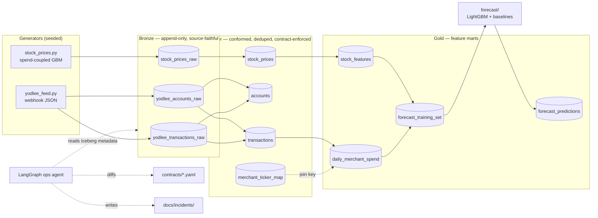

# Autonomous Lakehouse Platform — Design Spec

**Date:** 2026-08-09
**Status:** Approved
**Author:** Claude Code (AI-driven SDLC), reviewed by Rob Randhawa

---

## 1. Purpose

Build an Apache Iceberg lakehouse with Bronze/Silver/Gold layers that ingests two
independent feeds — consumer card transactions (Yodlee webhook format) and daily
equity prices — joins them on merchant identity, and trains a forecast model that
tests a concrete hypothesis:

> Aggregated consumer card spend at a company's merchants is a leading indicator
> of that company's forward stock returns.

The platform is operated by an agentic layer (LangGraph) that autonomously detects
schema drift, volume anomalies, and staleness against declared data contracts.

The repository is also a portfolio artifact demonstrating an AI-driven SDLC: the
git history, ADRs, and `docs/ai-sdlc/` record what the AI generated and what the
human reviewed, modified, or rejected.

### Non-goals

- Real market data ingestion (synthetic by design — see ADR-0004 rationale in §11)
- Multi-tenancy, RBAC, or credential management
- dbt, Great Expectations, Prometheus, or a serving API (deferred; contracts +
  pytest cover the quality need at this scale)
- Any claim of real-world trading alpha. The correlation is planted by the
  generator. The engineering is real; the alpha is synthetic and labelled as such.

---

## 2. Domain model

Six consumer-facing public companies. Their merchants appear in the transaction
feed; daily aggregated spend is the candidate leading indicator.

| Ticker | Merchant strings appearing in feed          | Planted lag | Planted beta |
|--------|---------------------------------------------|-------------|--------------|
| SBUX   | `Starbucks`, `STARBUCKS STORE #1234`        | 3 trading d | 0.35         |
| CMG    | `Chipotle Mexican Grill`, `CHIPOTLE 0455`   | 2           | 0.45         |
| TGT    | `Target`, `TARGET.COM`, `TARGET T-1088`     | 5           | 0.25         |
| LULU   | `lululemon athletica`, `LULULEMON #212`     | 7           | 0.40         |
| DPZ    | `Domino's Pizza`, `DOMINOS 8871`            | 2           | 0.30         |
| ULTA   | `ULTA Beauty`, `ULTA #0921`                 | 5           | 0.35         |

**Window:** 2024-01-01 → 2026-06-30 (~630 NYSE trading days).
**Users:** 2,000 synthetic accounts.
**Volume:** ~250,000 transactions (configurable via `--n-transactions`).

**Noise floor:** ~60% of transactions are at non-tracked merchants (grocery, gas,
rent, payroll, streaming, ATM). The merchant→ticker join must therefore actually
discriminate; it is not a trivially clean feed.

**Per-ticker heterogeneity is deliberate.** Distinct lags and betas mean a single
global rule cannot fit all six. The model must discover per-ticker structure, and
a model that fits all six equally well is evidence of a leak, not of skill.

---

## 3. Architecture



### 3.1 Bronze — raw, append-only, never modified

Preserves the source shape faithfully. Nested structs are **not** flattened here;
that is Silver's job. Every row carries ingestion lineage.

`bronze.yodlee_transactions_raw`

| Column | Type | Notes |
|---|---|---|
| `id` | long | Yodlee transaction id |
| `accountId` | long | |
| `date`, `transactionDate`, `postDate` | string | kept as source strings |
| `amount` | struct<amount: double, currency: string> | source struct preserved |
| `runningBalance` | struct<amount: double, currency: string> | |
| `merchant` | struct<id: string, source: string, categoryLabel: string, address: struct<...>> | |
| `status`, `baseType`, `subType` | string | |
| `category`, `categoryType`, `detailCategory`, `categorySource` | string | |
| `categoryId`, `detailCategoryId`, `highLevelCategoryId` | long | |
| `checkNumber` | string | |
| `isManual` | boolean | |
| `container` | string | null in source samples |
| `createdDate`, `lastUpdated` | string | ISO-8601 as source |
| `_ingested_at` | timestamptz | ingestion lineage |
| `_source_file` | string | |
| `_payload_hash` | string | sha256 of raw record |
| `_raw_payload` | string | full original JSON |

Partition: `day(_ingested_at)`.

`bronze.yodlee_accounts_raw` — same treatment for the account entity
(`id`, `providerName`, `providerId`, `accountType`, `accountStatus`,
`userClassification`, `isAsset`, `isManual`, `aggregationSource`, `balance`,
`currentBalance`, `availableBalance`, `createdDate`, `lastUpdated`, plus `_`-prefixed
lineage columns). Partition: `day(_ingested_at)`.

`bronze.stock_prices_raw` — `ticker`, `date`, `open`, `high`, `low`, `close`,
`adj_close`, `volume`, plus lineage columns. Partition: `day(_ingested_at)`.

### 3.2 Silver — conformed and trustworthy

`silver.transactions` — partition `month(txn_date)`

Transformations applied, in order:
1. **Type coercion** — dates to `date`, timestamps to `timestamptz`, amounts to
   `decimal(18,2)`.
2. **Deduplication** — on `id`, keep the row with the greatest `lastUpdated`;
   ties broken by greatest `_ingested_at`. Late-arriving corrections therefore win.
3. **Signed amount** — `signed_amount = -amount WHEN baseType='DEBIT' ELSE amount`.
   Source amounts are unsigned; direction lives in `baseType`. This is the single
   most common correctness trap in this dataset.
4. **Merchant normalization** — uppercase, strip punctuation, strip trailing store
   numbers (`#\d+`, ` \d{3,}$`), collapse whitespace → `merchant_normalized`.
5. **Currency** — assert USD. Non-USD rows are routed to
   `silver.transactions_quarantine` (same schema plus `quarantine_reason`,
   `quarantined_at`), never silently converted and never dropped. Quarantine depth
   is itself a contract expectation, so a rising reject rate surfaces to the agent.
6. **Contract validation** — see §6.

`silver.accounts` — current state per `id` (greatest `lastUpdated` wins).

`silver.merchant_ticker_map` — `merchant_normalized`, `ticker`, `company_name`,
`match_type` (`exact` | `prefix`), `effective_from`, `effective_to`. Seeded as a
table rather than hardcoded in transform logic so the mapping is data, auditable,
and evolvable — and so the drift agent can observe it.

`silver.stock_prices` — `ticker`, `trade_date`, OHLCV, `adj_close`, aligned to the
NYSE trading calendar (weekends/holidays absent, not forward-filled — absence is
information). Partition `month(trade_date)`.

### 3.3 Gold — feature marts

`gold.daily_merchant_spend` — grain `(ticker, spend_date)`
`gross_spend`, `txn_count`, `unique_accounts`, `avg_ticket`, `median_ticket`.
Computed from `signed_amount` where `categoryType='EXPENSE'`, joined via
`silver.merchant_ticker_map`.

`gold.stock_features` — grain `(ticker, trade_date)`
`ret_1d`, `ret_lag_1..5`, `realized_vol_21d`, `rsi_14`, `close`, `volume_z_21d`.

`gold.forecast_training_set` — grain `(ticker, trade_date)`; the leakage-safe join.

| Feature | Definition |
|---|---|
| `spend_mom_7d` | `gross_spend` 7d mean / 28d mean − 1 |
| `spend_z_28d` | z-score of `gross_spend` over trailing 28d |
| `txn_count_z_28d` | z-score of `txn_count` over trailing 28d |
| `avg_ticket_delta_7d` | 7d mean `avg_ticket` / 28d mean − 1 |
| `unique_acct_growth_7d` | 7d mean `unique_accounts` pct change vs prior 7d |
| `spend_surprise` | actual − seasonal-naive (same weekday, trailing 4w), scaled by trailing σ |
| `ret_lag_1..5` | from `gold.stock_features` |
| `realized_vol_21d`, `rsi_14`, `volume_z_21d` | from `gold.stock_features` |
| **target** `fwd_ret_5d` | `adj_close[t+5] / adj_close[t] − 1` |

**Every feature at date *t* is computed from data with timestamp ≤ *t*.** Rolling
windows are trailing and right-closed. The target alone looks forward. This
invariant is enforced by a dedicated test (§7).

`gold.forecast_predictions` — `ticker`, `trade_date`, `fold`, `y_true`,
`y_pred_model`, `y_pred_persistence`, `y_pred_arima`, `model_version`.

---

## 4. Iceberg usage

Catalog: PyIceberg `SqlCatalog` backed by SQLite at `./warehouse/catalog.db`;
data files under `./warehouse/`. No external services — `git clone && make all`
works offline.

Features deliberately exercised, each with a `make` target and a test:

| Feature | Where | Demonstrated by |
|---|---|---|
| Hidden partitioning | `day()` / `month()` transforms on all layers | partition pruning asserted in test |
| Snapshot isolation | every layer write creates a snapshot | re-run produces new snapshot, no dupes |
| Time travel | `make timetravel` | reads Bronze at snapshot N−1 vs N |
| Schema evolution | `merchantCategoryCode` added mid-stream to Bronze | old snapshots still readable; feeds drift agent |
| Snapshot expiry | `make maintenance` | `expire_snapshots` retains last 5 |
| Metadata introspection | agent `sense` node | reads schema, row counts, snapshot log |

Write semantics: Bronze is `append`. Silver and Gold are full `overwrite` of the
affected partitions (deterministic rebuild from Bronze), which keeps the PyIceberg
path simple and honest. The Spark engine additionally demonstrates `MERGE INTO`
for incremental Silver upserts and `rewrite_data_files` compaction — see §5.

---

## 5. Dual engine

```
src/lakehouse/engines/base.py            LakehouseEngine protocol
src/lakehouse/engines/pyiceberg_engine.py   default
src/lakehouse/engines/spark_engine.py       ENGINE=spark
```

Protocol surface (intentionally small):

```python
class LakehouseEngine(Protocol):
    def create_table(self, ident: str, schema: Schema, spec: PartitionSpec) -> None: ...
    def append(self, ident: str, data: pa.Table) -> None: ...
    def overwrite(self, ident: str, data: pa.Table, where: str | None = None) -> None: ...
    def scan_arrow(self, ident: str, snapshot_id: int | None = None) -> pa.Table: ...
    def sql(self, query: str) -> pa.Table: ...
```

PyIceberg engine: PyIceberg for catalog/commit, DuckDB for SQL over the scanned
Arrow tables. Spark engine: `iceberg-spark-runtime-3.5_2.12`, same protocol, plus
`merge_upsert()` and `compact()` extensions used only when `ENGINE=spark`.

A **parity test** builds Silver through both engines and asserts identical output
(sorted, column-aligned). It is `skipif` when `pyspark`/Java are unavailable, so CI
stays green on the pure-Python path while the abstraction remains proven rather
than merely asserted.

---

## 6. Data contracts

`contracts/{bronze_yodlee_transactions,bronze_stock_prices,silver_transactions,gold_forecast_training_set}.yaml`

```yaml
table: silver.transactions
version: 2
owner: data-platform
schema:
  - {name: id, type: long, nullable: false}
  - {name: txn_date, type: date, nullable: false}
  - {name: signed_amount, type: "decimal(18,2)", nullable: false}
  - {name: merchant_normalized, type: string, nullable: true}
expectations:
  - {type: not_null, column: id}
  - {type: unique, column: id}
  - {type: accepted_values, column: base_type, values: [CREDIT, DEBIT]}
  - {type: range, column: signed_amount, min: -100000, max: 100000}
  - {type: freshness, column: txn_date, max_lag_days: 3}
  - {type: row_count, min: 1000}
```

**Freshness is evaluated against a logical as-of date, never wall-clock time.**
The dataset ends 2026-06-30, so a wall-clock freshness check would fail
permanently and get muted — the classic way freshness monitoring dies. `AS_OF_DATE`
(default: max `txn_date` in Bronze, overridable via env for testing) is threaded
through the pipeline and the agent, so `max_lag_days` means "lag behind the
pipeline's logical now". The staleness scenario in §8 is produced by advancing
`AS_OF_DATE` past the data, not by waiting.

`src/contracts/validator.py` evaluates a contract against an Arrow table and returns
a `ValidationReport` (per-expectation pass/fail, observed values, affected row count).
Silver and Gold builds **fail closed** on a violation. The agent reads the same
contracts to diff against live Iceberg schemas — one source of truth, two consumers.

---

## 7. Forecast

**Task.** Predict `fwd_ret_5d` per (ticker, date). Regression, evaluated on both
error and directional/rank metrics.

**Validation.** Walk-forward CV, expanding window, 5 folds. Between each train and
test block, a **purge + embargo of 5 trading days** — the target horizon — so no
training row's target window overlaps the test block. Without this, `fwd_ret_5d`
leaks backward across the fold boundary and every metric is fiction.

**Models.**
- `LGBMRegressor` — modest depth and strong regularization; n≈630/ticker is small.
- Baseline A: persistence (predict 0 / last return).
- Baseline B: `ARIMA(1,1,1)` on the price series alone — the "transactions add
  nothing" null hypothesis.

**Metrics.** RMSE, MAE, directional accuracy, Spearman IC, and a long/short
backtest Sharpe (long top-2 tickers by predicted return, short bottom-2, daily
rebalance, no costs — labelled as such).

**Reporting.** `src/forecast/report.py` emits `docs/forecast-report.md` with a
per-ticker table of model vs each baseline, and an explicit verdict line per ticker:
beats baseline / does not beat baseline / inconclusive.

**The report states where the model loses.** With planted signal at known lags,
tickers with short lags and high betas (CMG, LULU) should be learnable; TGT at
lag 5 with beta 0.25 against realistic noise may well not be. Reporting six wins
would indicate a leak, and the no-leakage test plus purged CV exist to make that
outcome detectable rather than flattering.

---

## 8. Agentic ops layer

LangGraph state machine, `src/agent/graph.py`:

```
sense ──▶ detect ──▶ classify ──▶ decide ──┬─▶ act ──▶ END
                                            └─▶ END (no action)
```

| Node | Responsibility |
|---|---|
| `sense` | Read Iceberg metadata: current schema, snapshot log, row counts per snapshot, null rates, max `_ingested_at`. No table scans of data where metadata suffices. |
| `detect` | Diff observed state vs `contracts/*.yaml`. Emits typed `Finding`s: `SchemaDrift`, `VolumeAnomaly`, `Staleness`. |
| `classify` | Severity for each finding: `breaking` / `additive` / `benign`. Rules-first (added nullable column → additive; dropped or narrowed column → breaking; row count < 50% of trailing-7-snapshot median → breaking). Optional Claude API call for ambiguous cases only. |
| `decide` | Threshold on severity; dedupe against open incidents so re-runs don't spam. |
| `act` | Write `docs/incidents/YYYY-MM-DD-<slug>.md`; optionally `gh issue create`. **Dry-run by default** (`--execute` to actually file). |

Detection targets, with a reproducible scenario each (`make drift-demo`):
1. **Additive drift** — `merchantCategoryCode` appears in Bronze → `additive`.
2. **Breaking drift** — `amount.currency` dropped → `breaking`.
3. **Type narrowing** — `categoryId` long → int → `breaking`.
4. **Volume anomaly** — a day ingests 0 transactions → `breaking`.
5. **Staleness** — newest `_ingested_at` older than `max_lag_days` behind
   `AS_OF_DATE` (§6), reproduced by advancing `AS_OF_DATE` past the data.

The Claude API path is strictly optional. Absent `ANTHROPIC_API_KEY`, the agent
runs rules-only and all tests pass offline. This is a hard requirement, not a
fallback of convenience — CI must never depend on a model call.

---

## 9. Testing

`pytest`, with these as load-bearing:

| Test | Asserts |
|---|---|
| `test_generators_deterministic` | same seed → byte-identical output |
| `test_bronze_append_idempotent` | re-ingest creates a snapshot; Silver row count unchanged |
| `test_silver_dedup_late_arriving` | later `lastUpdated` wins over earlier |
| `test_signed_amount` | DEBIT negative, CREDIT positive |
| `test_merchant_normalization` | store numbers/punctuation stripped; known strings map to right ticker |
| **`test_no_lookahead`** | for random (ticker, t): recompute every feature using only rows ≤ t; assert equal to stored value |
| **`test_purged_cv_no_overlap`** | no train index within 5 trading days of any test index |
| `test_contract_violation_fails_closed` | injected null in non-nullable column aborts the build |
| `test_agent_scenarios` | each of the five drift scenarios yields the expected severity |
| `test_agent_offline` | agent completes with `ANTHROPIC_API_KEY` unset |
| `test_engine_parity` | PyIceberg and Spark Silver identical (`skipif` no Spark) |
| `test_time_travel` | snapshot N−1 lacks rows present in N |

CI (`.github/workflows/ci.yml`): ruff + pytest on the pure-Python path, plus a
smoke `make all` on a reduced dataset (`N_TRANSACTIONS=5000`).

---

## 10. Repository layout

```
autonomous_data_platform/
├── README.md                    architecture, AI-SDLC narrative, results
├── Makefile                     all | bronze silver gold forecast agent
│                                timetravel drift-demo maintenance test
├── pyproject.toml               uv-managed
├── contracts/*.yaml
├── docs/
│   ├── architecture/            ADR-0001..0006
│   ├── ai-sdlc/                 prompts/, decisions/, workflow.md
│   ├── incidents/               agent output
│   ├── forecast-report.md       generated
│   └── superpowers/specs/       this file
├── src/
│   ├── config.py                tickers, merchants, lags, betas, date window
│   ├── generators/              yodlee_feed.py, stock_prices.py
│   ├── lakehouse/               catalog.py, bronze.py, silver.py, gold.py,
│   │                            engines/{base,pyiceberg_engine,spark_engine}.py
│   ├── contracts/validator.py
│   ├── forecast/                features.py, models.py, backtest.py, report.py
│   └── agent/                   graph.py, sensors.py, classifier.py, actions.py
├── tests/
└── warehouse/                   gitignored Iceberg warehouse
```

---

## 11. Architecture decisions to be recorded

| ADR | Decision |
|---|---|
| 0001 | Iceberg over Delta/Hudi — engine-neutral, mature Python catalog story |
| 0002 | PyIceberg + DuckDB as default engine; Spark opt-in behind one protocol |
| 0003 | Medallion boundaries — what may and may not happen in each layer |
| 0004 | Synthetic spend-coupled prices over real market data — determinism, offline CI, and a learnable planted signal; real data would pair authentic prices with synthetic spend, guaranteeing zero correlation and a meaningless model |
| 0005 | YAML data contracts over Great Expectations at this scale |
| 0006 | Agentic ops rules-first with optional LLM; CI must not depend on a model call |

---

## 12. Success criteria

1. `make all` runs end-to-end offline from a clean clone, deterministically.
2. All Iceberg features in §4 demonstrated and tested.
3. `pytest` green, including no-leakage and purged-CV tests.
4. Forecast report published with per-ticker verdicts, including losses.
5. Agent detects all five §8 scenarios and writes incident reports.
6. Git history reads as an AI-SDLC log: phased commits stating what was reviewed
   and why it was accepted or modified.
